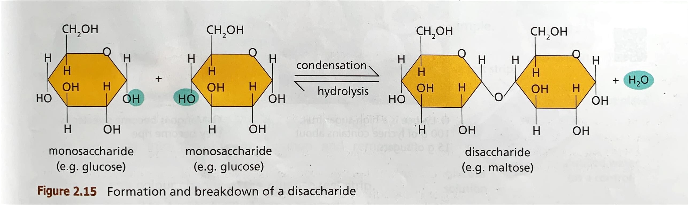

# Carbohydrates

> **Organic substances**, *$C_x(H_2O)_y$*, **monosaccharides** (*glucose*, *fructose*, *galactose*), **disaccharides** (*maltose*, *sucrose*, *lactose*), **polysaccharides** (*glycogen*, *starch*, *cellulose*), **condensation & hydrolysis**, **reducing sugars & Benedict's test**, *fuel in respiration*, *building blocks*, *polymers*, *energy reserves*, *structural materials*

- **Organic substances**

- Constitution: *carbon ($C$)*, *hydrogen ($H$)*, *oxygen ($O$)*

- General formula: $C_x(H_2O)_y$ ($H:O = 2:1$)

- Classification: **monosaccharides**, **disaccharides**, **polysaccharides** (molecule complexity)

- Functions: fuels, structural materials, energy storage etc.

## Monosaccharides (simple sugar)

- Complexity: *simplest form of carbohydrates*

- Properties: **soluble in water** & **sweet taste**

- Examples: e.g., **gluocse**, **fructose** (fruits::), **galactose** (milk::) etc.

- Functions: fuel in respiration to *release energy*; *building blocks* for other large molecules e.g., starch, nucleic acid etc.

### Reducing Sugars

- **Reducing sugar**: sugar that is a **reducing agent** (loses electrons in the reaction)

- Reducing sugar can be tested by **Benedict's test**::reducing sugar + Benedict's solution mixed and heated -> brick-red precipitate formed ($Fe^{2+}$ reduced to $Fe^+$)

- Examples: e.g., *glucose*, *fructose*, *galactose*, maltose, lactose etc.

## Disaccharides (double sugar)

- Complexity: **formed by two monosaccharides by condensation** (in the presence of enzymes for catalysis)

- Properties: **soluble in water** & **sweet taste**

- Examples:

  - glucose + glucose -> *maltose* + water (found in *germinated barley gains*)

  - glucose + fructose -> *sucrose* + water (found in *sugar cane*)

  - glucose + galactose -> *lactose* + water (found in *milk*)

### Condensation & Hydrolysis

- **Condensation**: Disaccharides are formed when **two monosaccharides combine**, with the *removal of a water molecule*

- **Hydrolysis**: A disaccharide is *broken down* into *two monosaccharides* with the *addition of a water molecule*

- Condensation & hydrolysis are reversible. Both require enzymes to catalyze the reactions.

## Polysaccharides

- Complexity: large molecules fromed by **condensation of a large number of monosaccharide molecules**; long chains arranged in different patterns

- Properties: **insoluble** or **only slightly soluble** in water & no sweet taste

- Note that polysaccharides are *polymers*, i.e., composed of many repeating subunits and can be hydrolysed and be condensed to

- Examples: e.g., *glycogen*, *starch*, *cellulose* etc.

- Functions: *energy reserves* (e.g., glycogen in animal bodies, starch stored in plants); *structural materials* (e.g., cellulose forms cell wall)

## Problems

1. Carbohydrates::| Biomolecules  | Functions                                           | Example(s)                              |
|---------------|-----------------------------------------------------|-----------------------------------------|
| Carbohydrates | Can be broken down in respiration to release energy | Glucose                                 |
|               | Energy storage                                      | Starch in plants and glycogen in humans |
|               | Component of plant cell walls                       | Cellulose                               |
