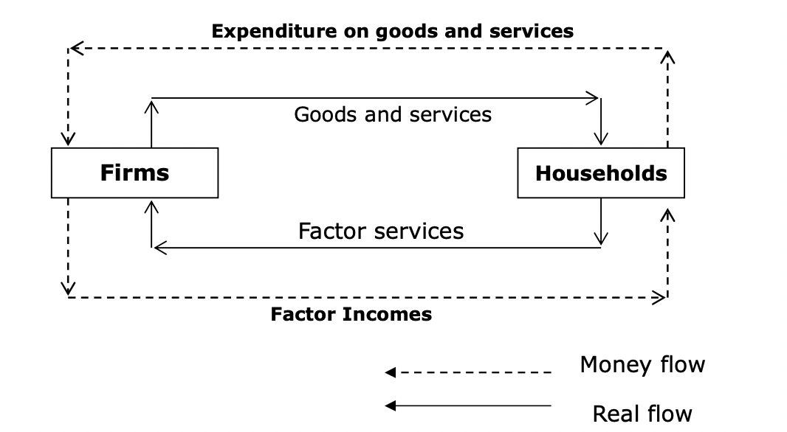

# Firms and Production

> **Basic circular flow model** (*firms & households*, *real & money flows*), *units of consumption v.s. production*, *income & revenue*, *expenditure & cost*

## Basic Circular Flow

### Main Sectors of an Economy

- Two main sectors: **households** & **firms**

- **Household**: *units of consumptions*, i.e., consume goods and services produced by the firms; *factor services* for the firms

- **Firms**: *units of production*

### Real Flow and Money Flow

> **Real flow** is the *flow of goods and services in exchange for the factor services*; households buy goods and services from the firms for consumption; firms use the factor services to produce goods and servcies for households
>
> **Money flow** is the *flow of money*; households provide factor services for firms, and receive *wage* as return; the payment for the factor services is a *cost* to the firnms; in the other hand, the spending of households on goods and services is the *expenditure* while the firms receive the *sales revenue*
