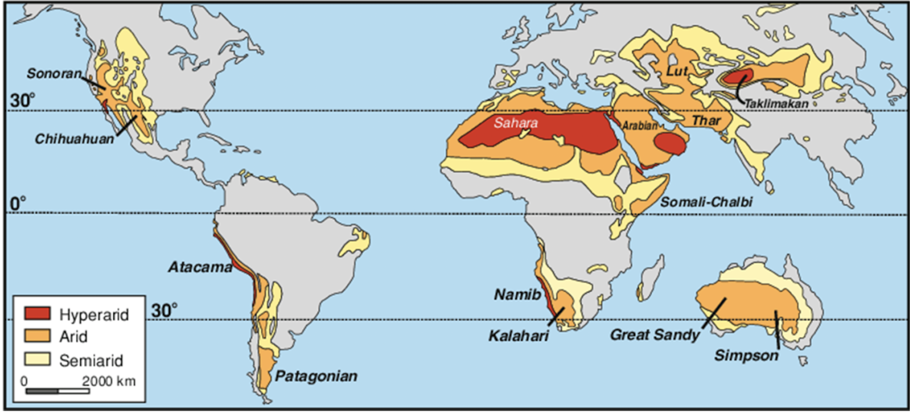

# Desert Climate

Keywords: **Desert**, **aridity**, e.g., *humidity*, *rainfall*, **pressure belt**, **wind**, **rain shadow effect**, **geographical locationn**, *types of deserts defined by its major materials*, *characteristics of its vegetation and the point of evolution*, *formation of oasis*

## Desert Environments

- Note that the characteristics of a climate should be analysed based on seasonal variations, 'trends'.

- Examples: Faya_largeau, Chad; Hami, China

- Defining characteristics of a desert climate: (Mainly defined by its **aridity**)
  - Humidity: Dry areas with **annual rainfall** of less than *250mm*
  - Temperature range: **Large daily temperature range**
  - Sunshine: Sunshine all day, **little cloud cover**
  - Rainfall: **Unreliable and unpredictable rainfall**
  - Rainfall distribution: Unevem rainfall distributon

- Geographical chacteristics:
  - **One-third** of the earth's land surface
  - Great impact on the *life* and the *landforms*

## Distribution of Deserts in the World

- Deserts are located in two regions: the **tropics** (*~23.5N/S*) => **tropical deserts** or higher latitudes (*~40N/S*) => **temperate deserts**

- Note that the **Arctic** and **Antarctica** are also considered as deserts due to their *leak of precipitation*.

## Features of Deserts

### Types of Deserts

1. **Sandy deserts**: e.g., Namib, Africa, with features, e.g., 400m high sand dunes

2. **Stony deserts**: e.g., Mojave, deserts, with features, e.g., 'desert pavements'

3. **Rocky deserts**: e.g., Sahara, Africa, with features, e.g., stone cliffs, rock pedestals etc.

### Special Land Features

- e.g., Yardangs, sand dunes (e.g., longitudinal dunes, star dunes), sandhills, rock cliffs, rock pedestals, buttes etc.

### Desert Vegetation

- Classical example: **cactus**, **acacia trees** etc.

- Characteristics of desert vegetation:
  - **Waxy surface** => *Reflect sunlight*
  - **Spiky/small leaves** => *Reduce water loss by evaporation and being eaten*
  - **Fleshy stem** => *Store water*
  - **Extensive root system** => *Increase water absorption*

- General characteristics: **disperse** vegetation, always found in **oasis** where water table meets the land surface

### Oasis

- Few nouns: e.g., Impermeable rock, aquifer, well oasis, oasis, water table etc.
  
- Formed by wind cutting out the surface, depression in arid regions until reaching the water table to have water exposed on the surface

## Causes for Aridity

1. **Far away from the sea**: *Little precipitation* carried by the sea breeze can reach the *continental interiors*

2. **Offshore winds**: *Prevailing wind* blowing offshore *limits moisture* reaching the land, e.g., Namib desert (concept of *relative humidity*; humidity $\propto$ rainfall )

3. **High pressure belt**: *Sinking air* in ~30N/S does not favor the formation of clouds and rain

4. **Rain shadow effect**: Air uplifted due to the pressence of *mountains* => condenses and precipitation falls on the windward side; as a result, air that continues to travel to the *leeward side* is extremely dry
