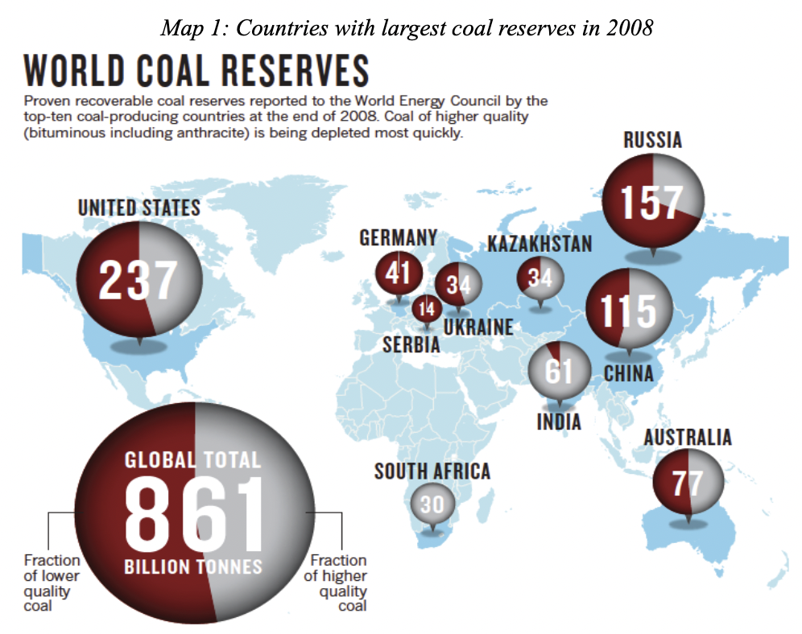
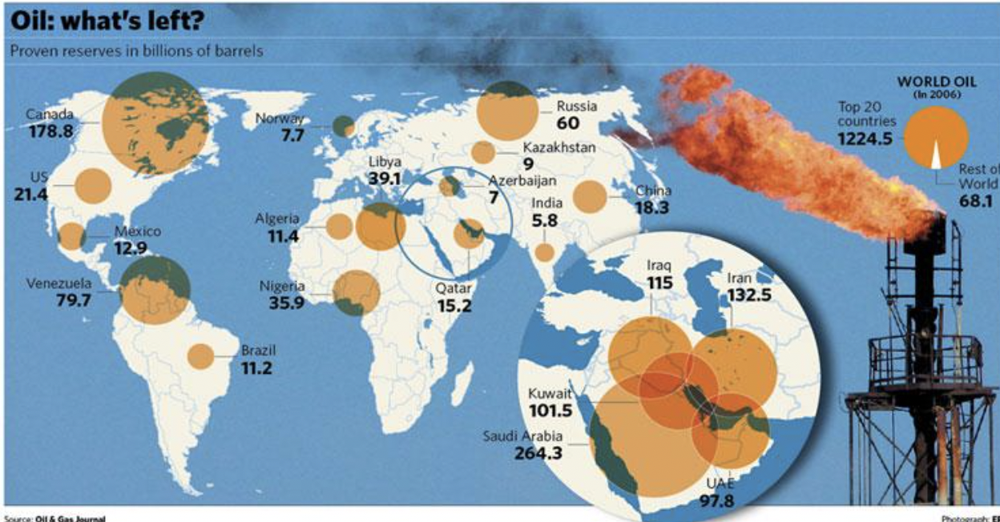

# Energy Resources

> **Non-renewable & renewable energy resources**, **fossil fuels** (*remains of dead organisms*, *will deplete soon*, *oil, coal, natural gas*)

## Major Types of Energy Resources

- Two main types of energy resources: **non-renewable** and **renewable energy resources**

- **Non-renewable energy resources**: e.g., (*fossil fuels*) coal, oil, natural gas, uranium for nuclear power etc.

- **Renewable energy resources**: e.g., solar energy, wind, hydroelectric, geothermal, fuel wood, biofuels etc.

### Fossil Fuels

- Sources: *remains of dead organisms*

- Restrictions: *takes millions of years to form*

- Examples: e.g., dead plants -> coals, dead sea-living plants & animals -> oil, natural gas -> decomposed organic matter

- Problems: non-renewable energy resources -> will deplete soon

#### Global Distribution of Oil and Coal Reserves

- Countries with large coal reserves: the USA, China, Russia, Australia, India etc.

- Countries with large oil reserves: Saudi Arabia, Canada, Iran, Iraq etc.::*Middle East countries*

- Major coal consumption countries: China, the USA, India, Russia etc.::*Countries which demand a high coal consumption generally have large enough coal reserves*

- Major oil consumption countries: the USA, China, Japan, India, Russia etc.::*Major oil consuming countries cannot produce what they consume (except Russia); import from oil-producing countries/ countries with large oil reserves by sea transportation (oil tanks)*; consequence: if the major oil producing countries stop exporting oil -> economic disaster

- Countries with high consumption of fossil fuels: the USA and Japan are *highly industrialized  developed countries* and have *high living standard* -> more fossil fuels demanded; for the USA, most oil is used for *transportation*; China and India are *newly industrialized developed countries* with *large population*; increasing level of industrialization & living standard -> higher demand in the future

- *Uneven pattern of oil production and consumption*: in general, trading of oil is a necessary condition for a country's economic development

#### Technological Implication of the Uneven Pattern of Oil Production and Consumption

- Examples: e.g., ultra-long *supertankers* that can transport *millions of barrels* a time -> save the cost if transportation

#### Political Implication of the Uneven Pattern of Oil Production and Consumption

- Political nature of the Middle East: as where the major oil reserves are found, the Middle East is *not politically stable* -> political instabilities such as warfaces would disrupt the oil production and increases the price; world leading countries, e.g., the US, set up military force there to maintain political stability in order to import steedy afordable oil

- Oil reserviors can be easily controlled -> military forces can be easily deployed to control the resevres -> barganing power and political influence

- With the increasing scarcity of oil -> more political conflicts competing for oil
